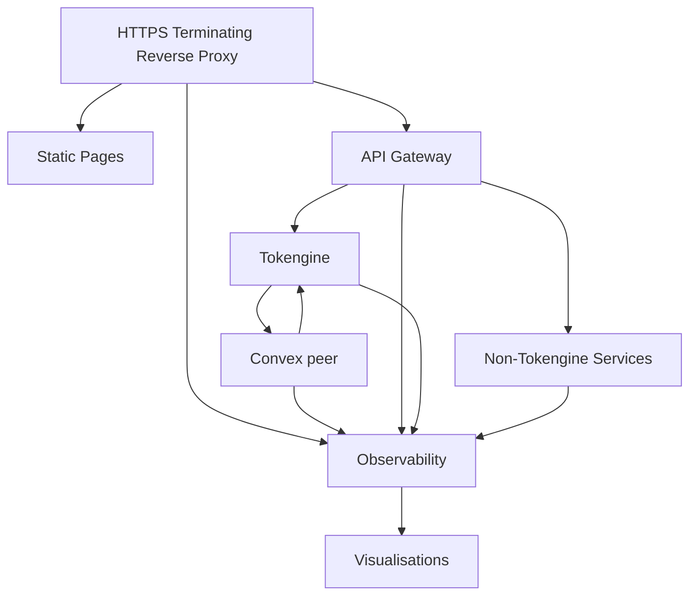

 Block diagram of reference TokEngine deployment

```mermaid
graph TD
    A[HTTPS Terminating Reverse Proxy] --> H[Static Pages]
    A --> B[API Gateway]
    B --> C[Tokengine]
    B --> D[Non-Tokengine Services]
    C --> G[Convex peer]
    G --> C
    A --> E[Observability]
    G --> E
    B --> E
    C --> E
    D --> E
    E --> F[Visualisations]
```

