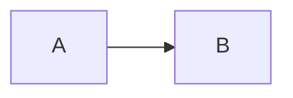
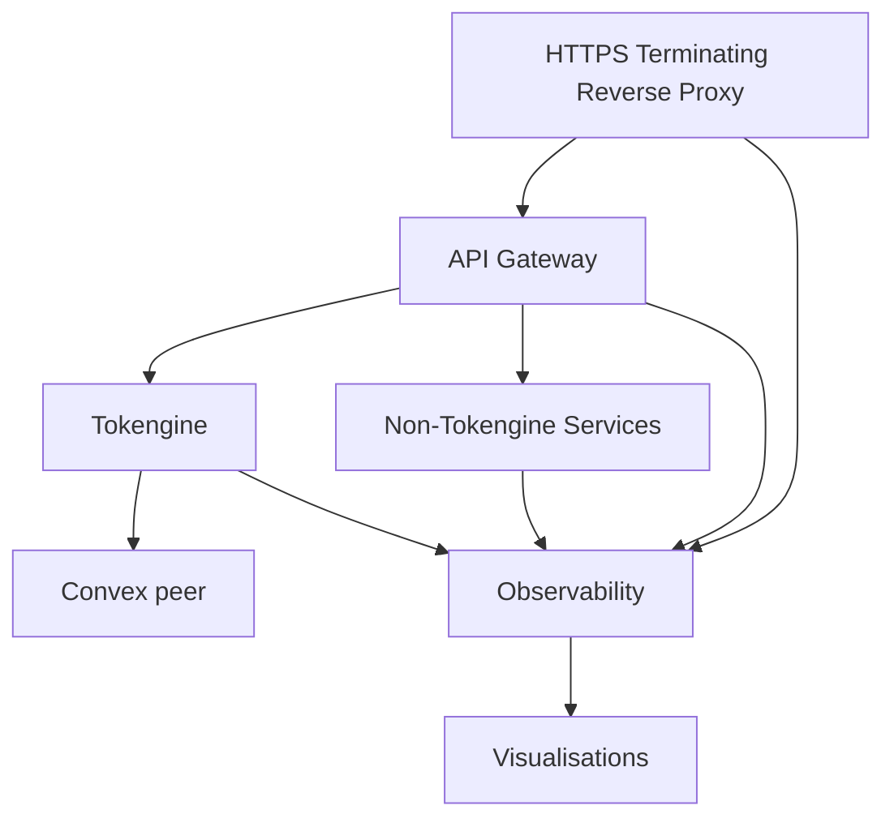

*** README ***

Mermaid test

The following code-block will be rendered as a Mermaid diagram:

```mermaid
flowchart LR
  A --> B
```

The following code-block will be rendered as a Mermaid graph:

```mermaid
graph TD
    A[HTTPS Terminating Reverse Proxy] --> B[API Gateway]
    B --> C[Tokengine]
    B --> D[Non-Tokengine Services]
    C --> G[Convex peer]
    A --> E[Observability]
    B --> E
    C --> E
    D --> E
    E --> F[Visualisations]
```

